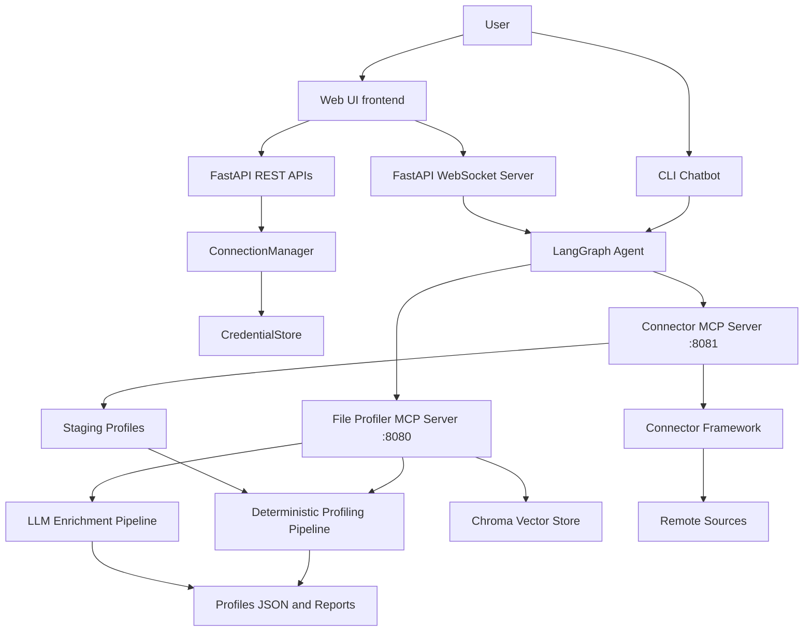

# System Architecture Master - Agentic Data Profiler

Generated on: 2026-04-01

## 1. System Scope

This project is a dual-MCP, agentic data profiling platform that supports:

- Local file profiling (CSV, Parquet, JSON, Excel, DuckDB/SQLite).
- Remote source profiling (S3, ADLS Gen2, GCS, Snowflake, PostgreSQL).
- Deterministic quality and relationship analysis.
- LLM-assisted enrichment via map-reduce plus vector retrieval.
- Interactive chat experiences via CLI and web UI.
- Encrypted credential management that bypasses LLM paths.

## 2. Top-Level Architecture



## 3. Runtime Components

### 3.1 Entry and Orchestration

- Core orchestration module: `file_profiler/main.py`.
- Local entrypoint: `file_profiler/__main__.py` and `file_profiler/mcp_server.py`.
- Remote connector entrypoint: `file_profiler/connectors/__main__.py` and `file_profiler/connector_mcp_server.py`.
- Agent entrypoint: `file_profiler/agent/__main__.py`.

### 3.2 Deterministic Pipeline Layers

1. Intake validation (`file_profiler/intake/validator.py`).
2. Content-based format classification (`file_profiler/classification/classifier.py`).
3. Memory strategy selection (`file_profiler/strategy/size_strategy.py`).
4. Format engines (`file_profiler/engines/*.py`).
5. Standardization (`file_profiler/standardization/normalizer.py`).
6. Column profiling (`file_profiler/profiling/column_profiler.py`).
7. Type inference (`file_profiler/profiling/type_inference.py`).
8. Quality checks (`file_profiler/quality/structural_checker.py`).
9. Relationship detection (`file_profiler/analysis/relationship_detector.py`).
10. Output writers (`file_profiler/output/*.py`).
11. MCP-serving and cache management (`file_profiler/mcp_server.py`, `file_profiler/connector_mcp_server.py`).

### 3.3 Agentic Layer

- Graph and tool orchestration: `file_profiler/agent/graph.py`.
- Chat runtime: `file_profiler/agent/chatbot.py`, `file_profiler/agent/cli.py`.
- LLM provider abstraction and fallback: `file_profiler/agent/llm_factory.py`.
- Enrichment map-reduce orchestration: `file_profiler/agent/enrichment_mapreduce.py`.
- Vector retrieval and clustering: `file_profiler/agent/vector_store.py`.
- Web transport and UI backend: `file_profiler/agent/web_server.py`.

### 3.4 Connector Layer

- URI parsing and source abstraction: `file_profiler/connectors/uri_parser.py`, `file_profiler/connectors/base.py`.
- Connector registration and lazy loading: `file_profiler/connectors/registry.py`.
- Cloud connectors: `file_profiler/connectors/cloud_storage.py`.
- Database connectors: `file_profiler/connectors/database.py`.
- Remote DuckDB execution: `file_profiler/connectors/duckdb_remote.py`.
- Connection lifecycle and credential resolution: `file_profiler/connectors/connection_manager.py`.
- Credential encryption at rest: `file_profiler/connectors/credential_store.py`.

## 4. Feature Inventory (Complete)

### 4.1 Profiling and Quality

- Profile single files and directories.
- Profile DuckDB and SQLite table sets.
- Profile remote object storage and remote DB schemas/tables.
- Standardize names, nulls, booleans, numeric text.
- Infer semantic column types with confidence.
- Compute cardinality, min/max, skewness, length distribution, top values.
- Detect structural and semantic quality flags.

### 4.2 Relationship Intelligence

- Deterministic FK candidate scoring by name, type, cardinality, overlap.
- Cross-table relationship reports.
- Mermaid ER diagram generation.
- Table-specific relationship retrieval.
- Profile comparison for schema drift.

### 4.3 LLM Enrichment and RAG

- Per-table map summaries.
- Description application into profiles.
- Embedding and incremental upserts with fingerprinting.
- Column-affinity clustering and discovered relationships.
- Reduce and meta-reduce synthesized analysis.
- Knowledge base semantic querying.
- Manifest/progress checkpointing for resumable enrichment state.

### 4.4 MCP Interfaces

- File Profiler MCP server with 13 tools.
- Connector MCP server with 16 tools.
- Health endpoints and cache-backed resources.
- Prompt endpoints for profile summary, migration readiness, quality reporting.

### 4.5 Web UI and UX

- WebSocket chat with progress streaming.
- Quick actions and live stats dashboard.
- Step tracker and phase hints.
- Session history and restore.
- Mermaid ER render, chart previews, fullscreen artifacts.
- File upload.
- Connection management modal and provider selection.
- Light/dark theme and command palette.

### 4.6 Security and Operations

- Credentials bypass LLM and chat history pathways.
- Optional encrypted credential persistence with `PROFILER_SECRET_KEY`.
- Upload path and source path safety handling.
- PostgreSQL-backed checkpointer/session persistence with memory fallback.
- Docker and compose deployment support.

## 5. Interface Map

### 5.1 File Profiler MCP Tools

- `profile_file`
- `profile_directory`
- `detect_relationships`
- `enrich_relationships`
- `check_enrichment_status`
- `reset_vector_store`
- `visualize_profile`
- `list_supported_files`
- `upload_file`
- `get_quality_summary`
- `query_knowledge_base`
- `get_table_relationships`
- `compare_profiles`

### 5.2 Connector MCP Tools

- `connect_source`
- `list_connections`
- `test_connection`
- `remove_connection`
- `list_tables`
- `list_schemas`
- `profile_remote_source`
- `remote_detect_relationships`
- `remote_enrich_relationships`
- `remote_check_enrichment_status`
- `remote_reset_vector_store`
- `remote_visualize_profile`
- `remote_get_quality_summary`
- `remote_query_knowledge_base`
- `remote_get_table_relationships`
- `remote_compare_profiles`

### 5.3 Web Server Endpoints and Channels

- REST connection APIs: list/create/delete/test connections.
- REST session APIs: list/upsert/delete sessions.
- REST upload API: multipart file upload.
- WebSocket chat channel for bidirectional streaming events.

## 6. Package Map

- `file_profiler/agent`: graph orchestration, chat runtime, web runtime, enrichment, vector store, progress.
- `file_profiler/connectors`: remote-source abstractions, connectors, secure credential handling.
- `file_profiler/engines`: format-specific extractors and samplers.
- `file_profiler/intake`, `classification`, `strategy`: ingestion and pre-engine decisions.
- `file_profiler/profiling`, `standardization`, `quality`: semantic and statistical normalization/profile logic.
- `file_profiler/analysis`: relationship inference.
- `file_profiler/models`: shared dataclasses/enums.
- `file_profiler/output`: profile/report/diagram writers.
- `frontend`: browser client for chat and operations.

## 7. Complete Backend Function and Method Index

Source: generated from all `file_profiler/**/*.py` modules.

```text
## file_profiler\agent\__main__.py
19: def main():

## file_profiler\agent\chatbot.py
41: def _trim_messages(messages: list) -> list:
250: async def run_chatbot(
306:     async def agent_node(state: AgentState):
357: async def _run_turn(graph, user_input: str, config: dict) -> None:
442: def _print_banner() -> None:
456: def _print_help() -> None:
480: def _load_dotenv() -> None:
494: def main(

## file_profiler\agent\cli.py
27: async def run_agent(
73: async def _run_autonomous(graph, initial_message: str, config: dict) -> str:
95: async def _run_interactive(graph, initial_message: str, config: dict) -> str:
160: def main():

## file_profiler\agent\enrichment.py
45: def extract_sample_rows(file_path: str, n: int = SAMPLE_ROWS_COUNT) -> list[dict]:
64: def _read_parquet_rows(path: Path, n: int) -> list[dict]:
76: def _read_csv_rows(path: Path, n: int) -> list[dict]:
94: def build_documents(
241: def create_vector_store(
344: async def enrich(

## file_profiler\agent\enrichment_mapreduce.py
41: async def _invoke_with_retry(llm, prompt: str, max_retries: int = _LLM_MAX_RETRIES) -> str:
85: class _RateLimitedSemaphore:
92:     def __init__(self, max_concurrent: int, rpm: int = 0):
98:     async def __aenter__(self):
116:     async def __aexit__(self, *args):
408: def _column_priority(col) -> int:
423: def _compute_adaptive_budget(profile: FileProfile, base_budget: int) -> int:
435: def _render_column_full(col) -> str:
452: def _render_column_compact(col) -> str:
463: def _truncate_text_to_budget(text: str, budget: int) -> str:
475: def _build_table_context(profile: FileProfile, token_budget: int = 2000) -> str:
534: def _build_relationships_context(report: RelationshipReport) -> str:
555: def _build_column_descriptions_context(
579: def save_enriched_profiles_json(
673: def _parse_map_response(
712: async def _summarize_one_table(
758: async def map_phase(
820:     async def _summarize_and_track(profile: FileProfile):
862: def embed_phase(
954: async def reduce_phase(
1037: def _scale_budget(base: int, n_items: int, min_per_item: int = 400) -> int:
1048: def _chunk_tables(table_names: list[str], chunk_size: int) -> dict[int, list[str]]:
1060: def cluster_phase(
1145: async def reduce_cluster_phase(
1188:     def _intra_cluster_rels(cluster_tables: list[str]) -> str:
1207:     async def _analyze_cluster(cluster_id: int, table_names: list[str]) -> tuple[int, str]:
1250: async def meta_reduce_phase(
1344: def extract_enriched_er_diagram(enrichment_text: str) -> str | None:
1363: def save_enriched_er_diagram(enrichment_text: str, output_path: Path) -> Path | None:
1391: def _apply_descriptions_to_profiles(
1428: def _build_discovered_relationships_context(
1448: def summarize_column_clusters(
1562: def _build_cluster_context(cluster_summaries: list) -> str:
1579: def _build_cluster_derived_relationships_context(
1606: async def batch_enrich(
1695: async def discover_and_reduce_pipeline(
1751:     async def _phase(step: int, name: str, detail: str = "") -> None:
1949: async def enrich(

## file_profiler\agent\enrichment_progress.py
23: def progress_file_path(output_dir: Path) -> Path:
28: def write_progress(
58: def read_progress(output_dir: Path) -> dict | None:
76: def clear_progress(output_dir: Path) -> None:
92: def manifest_path(output_dir: Path) -> Path:
97: def write_manifest(
139: def read_manifest(output_dir: Path) -> dict | None:
153: def check_enrichment_complete(

## file_profiler\agent\graph.py
91: def _derive_connector_url(base_url: str) -> str:
102: async def create_agent(
176:     async def agent_node(state: AgentState):

## file_profiler\agent\llm_factory.py
40: def get_llm(
88: def get_llm_with_fallback(
126: def get_reduce_llm(
154: def _api_key_env(provider: str) -> str:
164: def _get_timeout(phase: str = "default") -> int:
180: def _make_anthropic(model: str, temperature: float, timeout: int = 0) -> BaseChatModel:
194: def _make_openai(model: str, temperature: float, timeout: int = 0) -> BaseChatModel:
208: def _make_google(model: str, temperature: float, timeout: int = 0) -> BaseChatModel:
222: def _make_groq(model: str, temperature: float, timeout: int = 0) -> BaseChatModel:

## file_profiler\agent\progress.py
59: class ProgressTracker:
71:     def __init__(self) -> None:
81:     def elapsed_total(self) -> float:
87:     async def start_tool(self, tool_name: str, args: dict) -> None:
111:     async def finish_tool(self, tool_name: str, content: str) -> None:
143:     async def finish_thinking(self) -> None:
153:     def print_summary(self) -> None:
164:     async def start_thinking(self) -> None:
179:     async def _spin(self, tool_name: str) -> None:
208:     async def _spin_thinking(self) -> None:
227: def _get_stage_hints(tool_name: str) -> list[str]:
304: def _extract_summary(tool_name: str, content: str) -> str:
406: def _render_bar(pct: float) -> str:
414: def _fmt_time(seconds: float) -> str:
423: def _truncate(text: str, max_len: int) -> str:
430: def _clear_line() -> None:

## file_profiler\agent\session_manager.py
26: async def touch_session(session_id: str, label: str = "") -> dict:
59: async def update_session(
104: async def list_sessions(limit: int = 30) -> list[dict]:
126: async def delete_session(session_id: str) -> bool:
150: def _row_to_dict(row) -> dict:
168: def _memory_touch(session_id: str, label: str = "") -> dict:
187: def _memory_update(
203: def _memory_list(limit: int) -> list[dict]:

## file_profiler\agent\state.py
12: class AgentState(TypedDict):

## file_profiler\agent\vector_store.py
30: def _table_fingerprint(table_name: str, row_count: int, col_count: int) -> str:
43: def get_embeddings():
52: def warm_embeddings() -> None:
66: def get_or_create_store(
106: def clear_store(persist_dir: Path) -> None:
146: def _batched_add_documents(store, docs: list) -> None:
162: def upsert_table_summary(
190: def batch_upsert_table_summaries(
245: def batch_upsert_column_descriptions(
335: def upsert_relationship_doc(
354: def upsert_relationship_candidates(
438: def query_relationship_candidates(
464: def query_similar_tables(
483: def get_all_summaries(store) -> list[Document]:
499: def list_stored_tables(store) -> list[str]:
505: def get_stored_fingerprints(store) -> dict[str, str]:
515: def get_table_embeddings(store) -> tuple[list[str], list[list[float]]]:
556: def get_or_create_column_store(persist_dir: Path):
579: def upsert_column_descriptions(
673: def build_table_affinity_matrix(
801: def cluster_by_column_affinity(
900: def _fetch_column_embeddings(
956: def cluster_columns_dbscan(
1062: def derive_relationships_from_clusters(
1237: def get_or_create_cluster_store(persist_dir: Path):
1260: def upsert_cluster_summary(

## file_profiler\agent\web_server.py
58: def _extract_preview(tool_name: str, content: str) -> dict | None:
267: async def api_list_connections():
286: async def api_create_connection(request: Request):
322: async def api_delete_connection(connection_id: str):
331: async def api_test_connection(connection_id: str):
351: async def _startup_event():
359: async def _shutdown_event():
385: async def index():
393: async def api_list_sessions():
401: async def api_upsert_session(request: Request):
423: async def api_delete_session(session_id: str):
440: async def upload_file(file: UploadFile):
485: async def _build_graph(
517:     def _make_client(include_connector: bool = True):
570:     async def agent_node(state: AgentState):
599: async def websocket_chat(websocket: WebSocket):
615:     async def _safe_send(msg: dict) -> bool:
746: async def _get_history_messages(graph, session_id: str) -> list[dict]:
796: async def _stream_turn(
813:     async def _send_stage_hints(tool_id: str, tool_name: str):
1142: def run(host: str = "0.0.0.0", port: int = 8501) -> None:

## file_profiler\analysis\relationship_detector.py
65: def detect(profiles: list[FileProfile]) -> RelationshipReport:
119:     def _get_top_set(col: ColumnProfile) -> frozenset[str]:
223: def _is_pk_eligible(col: ColumnProfile) -> bool:
243: def _looks_like_id_column(name: str) -> bool:
253: def _is_fk_eligible(col: ColumnProfile) -> bool:
272: def _has_disqualifying_flag(col: ColumnProfile) -> bool:
280: def _score_pair(
324: def _name_score(fk_name: str, pk_name: str, pk_table: str) -> tuple[float, str]:
368: def _type_score(
387: def _cardinality_score(
425: def _value_overlap(
448: def _value_overlap_sets(
458: def _overlap_score_from_pct(

## file_profiler\classification\classifier.py
52: def classify(intake: IntakeResult) -> FileFormat:
104: def _read_raw(path: Path) -> bytes:
110: def _decode_sniff(raw: bytes, intake: IntakeResult) -> str:
148: def _zip_first_data_entry(zf: zipfile.ZipFile) -> str:
169: def _is_parquet(path: Path, raw: bytes, compression: Optional[str]) -> bool:
201: def _is_excel(path: Path, raw: bytes, compression: Optional[str]) -> bool:
232: def _is_sqlite(raw: bytes) -> bool:
237: def _is_duckdb(path: Path, raw: bytes) -> bool:
259: def _is_json(text: str) -> bool:
288: def _is_csv(text: str, delimiter_hint: Optional[str]) -> bool:

## file_profiler\config\database.py
41: async def get_pool() -> Optional["psycopg_pool.AsyncConnectionPool"]:
81: async def close_pool() -> None:
109: async def _init_schema(pool: "psycopg_pool.AsyncConnectionPool") -> None:
121: async def get_checkpointer():

## file_profiler\config\env.py
41: def _auto_duckdb_memory() -> str:
106: def get_postgres_dsn() -> str:
158: def _validate_config() -> None:

## file_profiler\connector_mcp_server.py
71: class _LRUCache(OrderedDict):
74:     def __init__(self, max_size: int) -> None:
78:     def __setitem__(self, key: str, value: dict) -> None:
87:     def __getitem__(self, key: str) -> dict:
104: async def health_check(request) -> "JSONResponse":
118: def _to_dict(profile: FileProfile) -> dict:
134: def _cache_profile(profile: FileProfile) -> dict:
141: def _compute_fingerprints(profiles: list) -> dict[str, str]:
150: def _report_to_dict(
164: def _load_relationship_data(staging_dir: Path) -> dict | None:
181: def _staging_dir(connection_id: str) -> Path:
188: def _materialize_profiles(connection_id: str, profiles: list[FileProfile]) -> Path:
211: def _get_staged_profiles(connection_id: str) -> list[FileProfile]:
236: def _resolve_connection_id(connection_id: str) -> str:
257: async def connect_source(
311: async def list_connections(ctx: Context = None) -> list:
340: async def test_connection(
366: async def remove_connection(
394: async def list_tables(
442: async def list_schemas(
485: async def profile_remote_source(
566: async def remote_detect_relationships(
634: async def remote_enrich_relationships(
691: async def _enrich_relationships_impl(
748:     async def _report(step: int, name: str, detail: str = "",
840:         async def _on_table_done(done_in_batch, total_in_batch, table_name):
905:     async def _on_phase(step: int, name: str, detail: str = ""):
957: async def remote_check_enrichment_status(
1010: async def remote_reset_vector_store(
1082: async def remote_visualize_profile(
1209: async def remote_get_quality_summary(
1240: async def remote_query_knowledge_base(
1316: async def remote_get_table_relationships(
1400: async def remote_compare_profiles(
1502: async def get_cached_profile(table_name: str) -> str:
1512: async def get_cached_relationships() -> str:
1526: async def summarize_profile(table_name: str) -> str:
1548: async def migration_readiness(connection_id: str) -> str:
1571: async def quality_report(table_name: str) -> str:
1602: def _graceful_shutdown(signum, frame) -> None:
1613: def main() -> None:

## file_profiler\connectors\base.py
23: class ConnectorError(Exception):
32: class SourceDescriptor:
53:     def is_remote(self) -> bool:
57:     def is_object_storage(self) -> bool:
61:     def is_database(self) -> bool:
65:     def is_directory_like(self) -> bool:
77:     def display_name(self) -> str:
90: class RemoteObject:
102: class BaseConnector(ABC):
116:     def test_connection(
127:     def configure_duckdb(
139:     def list_objects(
151:     def duckdb_scan_expression(
168:     def list_schemas(
182:     def supports_duckdb(self, descriptor: SourceDescriptor) -> bool:

## file_profiler\connectors\cloud_storage.py
33: class CloudStorageConnector(BaseConnector):
40:     def __init__(self, provider: str) -> None:
49:     def test_connection(
67:     def configure_duckdb(self, con, descriptor, credentials) -> None:
81:     def list_objects(
99:     def duckdb_scan_expression(
129:     def _list_s3(
178:     def _list_adls(
235:     def _list_gcs(
285: def _ext_to_format(ext: str) -> str:

## file_profiler\connectors\connection_manager.py
28: class ConnectionInfo:
40: class ConnectionSummary:
51: class TestResult:
58: class ConnectionManager:
66:     def __init__(self) -> None:
70:     def _load_persisted(self) -> None:
95:     def _persist(self) -> None:
120:     def register(
159:     def get(self, connection_id: str) -> ConnectionInfo:
172:     def remove(self, connection_id: str) -> bool:
180:     def list_connections(self) -> list[ConnectionSummary]:
194:     def test(self, connection_id: str) -> TestResult:
232:     def resolve_credentials(self, descriptor: SourceDescriptor) -> dict:
251:     def has_connection(self, connection_id: str) -> bool:
261: def get_connection_manager() -> ConnectionManager:
270: def _env_credentials(scheme: str) -> dict:
311: def _add_if_set(creds: dict, key: str, env_var: str) -> None:

## file_profiler\connectors\credential_store.py
32: def _get_fernet_key() -> Optional[bytes]:
47: def _encrypt(plaintext: str, key: bytes) -> str:
54: def _decrypt(ciphertext: str, key: bytes) -> str:
66: class StoredConnection:
77: class CredentialStore:
85:     def __init__(self) -> None:
100:     def persistence_enabled(self) -> bool:
103:     def encrypt_credentials(self, credentials: dict) -> str:
111:     def decrypt_credentials(self, encrypted: str) -> dict:
122:     def save_to_file(self, connections: dict[str, StoredConnection]) -> None:
148:     def load_from_file(self) -> dict[str, StoredConnection]:
175:     def delete_file(self) -> None:
185: def get_credential_store() -> CredentialStore:

## file_profiler\connectors\database.py
34: def _escape_libpq_value(value: str) -> str:
50: def _escape_sql_string(value: str) -> str:
59: def _quote_snowflake_identifier(name: str) -> str:
72: class DatabaseConnector(BaseConnector):
78:     def __init__(self, db_type: str) -> None:
83:     def supports_duckdb(self, descriptor: SourceDescriptor) -> bool:
87:     def test_connection(
97:     def configure_duckdb(self, con, descriptor, credentials) -> None:
107:     def list_objects(
118:     def duckdb_scan_expression(
145:     def _pg_conninfo(
182:     def _test_postgresql(
204:     def _list_postgresql(
241:     def list_schemas(
252:     def _list_schemas_postgresql(
279:     def _list_schemas_snowflake(
303:     def _test_snowflake(
318:     def _list_snowflake(
354:     def snowflake_count_and_sample(
403:     def snowflake_schema(
439:     def _snowflake_connect(self, descriptor, credentials):

## file_profiler\connectors\duckdb_remote.py
26: def create_remote_connection(
72: def remote_count(
92: def remote_sample(
123: def remote_schema(
143: def _configure_s3(con: duckdb.DuckDBPyConnection, credentials: dict) -> None:
159: def _configure_gcs(con: duckdb.DuckDBPyConnection, credentials: dict) -> None:
177: def _configure_adls(con: duckdb.DuckDBPyConnection, credentials: dict) -> None:
197: def _configure_postgres(con: duckdb.DuckDBPyConnection) -> None:

## file_profiler\connectors\registry.py
24: class ConnectorRegistry:
32:     def __init__(self) -> None:
37:     def register(self, scheme: str, connector: BaseConnector) -> None:
41:     def register_lazy(self, scheme: str, factory: callable) -> None:
49:     def get(self, scheme: str) -> BaseConnector:
87:     def supported_schemes(self) -> list[str]:
91:     def supports(self, scheme: str) -> bool:
97:     def _register_builtins(self) -> None:
103:         def _cloud(provider):
104:             def factory():
109:         def _database(db_type):
110:             def factory():

## file_profiler\connectors\uri_parser.py
26: def is_remote_uri(path_or_uri: str) -> bool:
36: def parse_uri(
93: def _parse_object_storage(
113: def _parse_adls(
141: def _parse_snowflake(
174: def _parse_postgresql(

## file_profiler\engines\csv_engine.py
61: def profile(
125: def _profile_with_duckdb(
179: class _CsvStructure:
184:     def __init__(
199: def _detect_structure(path: Path, intake: IntakeResult) -> _CsvStructure:
205: def _detect_structure_from_lines(
253: def _determine_delimiter(lines: list[str], hint: Optional[str]) -> str:
280: def _measure_corruption(
313: def _single_pass_profile(
417: def _add_to_sample(
448: def _detect_headers(
458: def _detect_headers_from_rows(
487: def _looks_numeric(value: str) -> bool:
496: def _deduplicate_headers(headers: list[str]) -> list[str]:
513: def _estimate_row_count(
528: def _exact_row_count(path: Path, intake: IntakeResult, struct: _CsvStructure) -> int:
537: def _stream_row_count(path: Path, intake: IntakeResult, struct: _CsvStructure) -> int:
547: def _extrapolate_row_count(
598: def _sample_rows(
612: def _read_all_rows(
625: def _reservoir_sample(
648: def _skip_interval_sample(
667: def _build_raw_columns(
702: def _zip_csv_entries(path: Path) -> list[str]:
729: def _zip_entry_text(
747: def _profile_zip_partition(
801: def _zip_read_first_lines(
815: def _zip_parse_rows(
832: def _zip_stream_count(
849: def _zip_sample_entries(
865: def _zip_read_all(
884: def _zip_reservoir(
919: def _zip_skip_interval(
949: def _zip_count_and_sample(
1001: def _open_text(path: Path, intake: IntakeResult):
1017: class _ZipTextWrapper:
1027:     def __init__(self, path: Path, encoding: str) -> None:
1033:     def __enter__(self):
1043:     def __exit__(self, *_):
1050: def _make_reader(fh, struct: _CsvStructure) -> csv.reader:
1057: def _read_first_lines(path: Path, intake: IntakeResult, n: int) -> list[str]:
1072: def _parse_rows(

## file_profiler\engines\db_engine.py
38: class TableResult:
50: def list_tables(path: Path, fmt: FileFormat) -> list[str]:
59: def profile(
97: def _duckdb_list_tables(path: Path) -> list[str]:
124: def _duckdb_profile_tables(path: Path, tables: list[str]) -> list[TableResult]:
140: def _duckdb_profile_one(con: duckdb.DuckDBPyConnection, table: str) -> TableResult:
235: def _duckdb_connect(path: Path) -> duckdb.DuckDBPyConnection:
247: def _sqlite_list_tables(path: Path) -> list[str]:
261: def _sqlite_profile_tables(path: Path, tables: list[str]) -> list[TableResult]:
277: def _sqlite_profile_one(con: sqlite3.Connection, table: str) -> TableResult:
340: def _reservoir_sample_cursor(cursor, k: int) -> list[tuple]:
354: def _to_str(v: Any) -> str:

## file_profiler\engines\duckdb_sampler.py
48: def _get_thread_connection() -> duckdb.DuckDBPyConnection:
60: def _cleanup_connections():
72: def duckdb_connection():
87: def duckdb_count(
112: def duckdb_sample(
162: def duckdb_count_parquet(
177: def duckdb_sample_parquet(
210: def duckdb_count_json(
225: def duckdb_sample_json(
258: def _to_str(v: Any) -> str:
280: def _connect() -> duckdb.DuckDBPyConnection:

## file_profiler\engines\excel_engine.py
48: def profile(
82: def _profile_xlsx(
154: def _read_sheet_rows(ws, read_only: bool) -> list[list[Any]]:
169: def _profile_xls(
234: def _detect_headers(rows: list[list[Any]]) -> tuple[list[str], bool]:
257: def _looks_numeric(value: Any) -> bool:
273: def _is_empty(value: Any) -> bool:
282: def _cell_to_header(value: Any) -> str:
289: def _deduplicate_headers(headers: list[str]) -> list[str]:
307: def _sample_rows(
321: def _reservoir_sample(rows: list[list[Any]]) -> list[list[Any]]:
338: def _skip_interval_sample(rows: list[list[Any]]) -> list[list[Any]]:
348: def _build_raw_columns(
379: def _cell_to_str(value: Any) -> Optional[str]:

## file_profiler\engines\json_engine.py
52: def profile(
117: def _detect_shape(path: Path, intake: IntakeResult) -> JSONShape:
186: def _has_deep_nesting(obj: dict, depth: int = 0, max_depth: int = 2) -> bool:
206: def _discover_schema(
239: class _FieldInfo:
243:     def __init__(self, key: str) -> None:
250:     def occurrence_ratio(self) -> float:
256:     def has_type_conflict(self) -> bool:
266: def _assign_flatten_strategies(
289: def _discover_schema_and_sample(
356: def _try_duckdb_path(
436: def _iter_records(
461: def _iter_ndjson(path: Path, intake: IntakeResult) -> Generator[dict, None, None]:
476: def _iter_array(path: Path, intake: IntakeResult) -> Generator[dict, None, None]:
500: def _iter_records_from_text(
521: def _reservoir_sample(
544: def _skip_interval_sample(
566: def _flatten_record(
603: def _build_raw_columns(
645: def _profile_single_object(
690: def _value_to_str(value: Any) -> Optional[str]:
708: def _open_text(path: Path, intake: IntakeResult):
721: class _ZipTextWrapper:
724:     def __init__(self, path: Path, encoding: str) -> None:
730:     def __enter__(self):
742:     def __exit__(self, *_):
749: def _read_text_snippet(path: Path, intake: IntakeResult, max_bytes: int = 4096) -> str:
775: def _read_full_text(path: Path, intake: IntakeResult) -> str:
793: def _is_ndjson_format(path: Path, intake: IntakeResult) -> bool:

## file_profiler\engines\parquet_engine.py
52: class _FlatCol:
75: def profile(
145: def _flatten_schema(schema: pa.Schema) -> list[_FlatCol]:
159: def _walk_field(
200: def _profile_with_duckdb(
267: def _profile_memory_safe(
307: def _profile_row_groups(
416: def _navigate_nested(col: pa.ChunkedArray, nested_steps: list[str]) -> pa.ChunkedArray:
437: def _chunked_to_pylist(col: pa.ChunkedArray) -> list:
442: def _val_to_str(value: Any, is_stringified: bool) -> Optional[str]:
474: def _null_count_from_metadata(

## file_profiler\intake\column_profiler.py
28: def profile(raw: RawColumnData) -> ColumnProfile:
120: def _determine_cardinality(unique_ratio: float) -> Cardinality:
128: def _compute_range_stats(
170: def _compute_length_stats(

## file_profiler\intake\errors.py
1: class FileIntakeError(Exception):
5: class EmptyFileError(FileIntakeError):
9: class CorruptFileError(FileIntakeError):
17: class UnsupportedEncodingError(FileIntakeError):

## file_profiler\intake\validator.py
70: class IntakeResult:
89: def validate(path: str | Path) -> IntakeResult:
150: def _check_exists(path: Path) -> None:
157: def _check_size(path: Path) -> int:
164: def _read_raw_bytes(path: Path) -> bytes:
169: def _detect_compression(header: bytes) -> Optional[str]:
177: def _get_sniff_bytes(path: Path, compression: Optional[str]) -> bytes:
199: def _detect_bom(raw: bytes) -> tuple[Optional[str], bool, bytes]:
213: def _detect_encoding(raw: bytes, bom_encoding: Optional[str], path: Path) -> str:
270: def _sniff_delimiter(raw: bytes, encoding: str) -> Optional[str]:

## file_profiler\main.py
84: def _profile_columns_parallel(raw_columns: list) -> list:
106: def run(
132: def profile_file(
157:     def _progress(step: int, total: int = 8, msg: str = "") -> None:
257: def profile_database(
301:     def _process_table(tr):
395: def profile_directory(
444: def _profile_directory_sequential(
474: def _profile_one(
484: def _profile_directory_parallel(
541: def profile_remote(
582:     def _progress(step: int, total: int = 5, msg: str = "") -> None:
602: def _profile_remote_storage(
655: def _profile_remote_database(
729: def _profile_single_remote(
748: def _rows_to_raw_columns(
777: def _assemble_remote_profile(
841: def _guess_format(filename: str) -> str:
853: def analyze_relationships(

## file_profiler\mcp_server.py
79: class _LRUCache(OrderedDict):
82:     def __init__(self, max_size: int) -> None:
86:     def __setitem__(self, key: str, value: dict) -> None:
95:     def __getitem__(self, key: str) -> dict:
109: async def health_check(request) -> "JSONResponse":
122: def _to_dict(profile: FileProfile) -> dict:
138: def _cache_profile(profile: FileProfile) -> dict:
150: def _compute_fingerprints(profiles: list) -> dict[str, str]:
163: def _compute_file_fingerprints(directory: Path) -> dict[str, str]:
179: def _load_relationship_data() -> dict | None:
196: def _report_to_dict(
217: def _resolve_dir(path: Path) -> Path:
230: def _seed_dir_cache(resolved_dir: Path, profiles: list) -> None:
255: def _get_or_profile_directory(resolved: Path) -> list:
335: async def profile_file(file_path: str, ctx: Context) -> "dict | list[dict]":
387:     async def _report(step: int, total: int, msg: str) -> None:
390:     def _sync_progress(step: int, total: int, msg: str) -> None:
416: async def profile_directory(
456: async def detect_relationships(
516: async def enrich_relationships(
582: async def _enrich_relationships_impl(
646:     async def _report(step: int, name: str, detail: str = "",
743:         async def _on_table_done(done_in_batch, total_in_batch, table_name):
810:     async def _on_phase(step: int, name: str, detail: str = ""):
870: async def check_enrichment_status(dir_path: str, ctx: Context = None) -> dict:
932: async def reset_vector_store(ctx: Context = None) -> dict:
994: async def visualize_profile(
1142: async def list_supported_files(dir_path: str, ctx: Context = None) -> list[dict]:
1207: async def upload_file(
1244: async def get_quality_summary(file_path: str, ctx: Context = None) -> dict:
1290: async def query_knowledge_base(
1370: async def get_table_relationships(
1452: async def compare_profiles(
1553: async def get_cached_profile(table_name: str) -> str:
1563: async def get_cached_relationships() -> str:
1577: async def summarize_profile(table_name: str) -> str:
1599: async def migration_readiness(dir_path: str) -> str:
1622: async def quality_report(table_name: str) -> str:
1653: def _graceful_shutdown(signum, frame) -> None:
1673: def main() -> None:
1703:     def _prewarm():

## file_profiler\models\enums.py
4: class FileFormat(str, Enum):
16: class SizeStrategy(str, Enum):
29: class InferredType(str, Enum):
47: class Cardinality(str, Enum):
57: class QualityFlag(str, Enum):
85: class FlattenStrategy(str, Enum):
98: class SourceType(str, Enum):
106: class JSONShape(str, Enum):

## file_profiler\models\file_profile.py
20: class TopValue:
27: class TypeInferenceResult:
45: class RawColumnData:
67: class QualitySummary:
77: class ColumnProfile:
151: class FileProfile:
199: class ClusterSummary:

## file_profiler\models\relationships.py
15: class ColumnRef:
22: class ForeignKeyCandidate:
52: class RelationshipReport:

## file_profiler\output\er_diagram_writer.py
48: def write(
72: def _deduplicate_relationships(
118: def _is_audit_fk(fk_col_name: str) -> bool:
123: def generate(
236: def _safe(name: str) -> str:

## file_profiler\output\profile_writer.py
37: def write(profile: FileProfile, output_path: str | Path) -> None:
81: def compute_quality_summary(profile: FileProfile) -> QualitySummary:
113: def serialise(obj) -> object:

## file_profiler\output\relationship_writer.py
25: def write(report: RelationshipReport, output_path: str | Path) -> None:

## file_profiler\profiling\column_profiler.py
70: def profile(raw: RawColumnData) -> ColumnProfile:
169: def _compute_distinct(non_null: list[str], total: int) -> tuple[int, bool]:
182: def _bucket_cardinality(unique_ratio: float) -> Cardinality:
190: def _check_key_candidate(unique_ratio: float, null_count: int, inferred_type: InferredType) -> bool:
202: def _compute_min_max(
225: def _compute_skewness(non_null: list[str], inferred_type: InferredType) -> Optional[float]:
249: def _compute_numeric_stats(
314: def _percentile_float(sorted_values: list[float], p: float) -> float:
326: def _compute_avg_length(non_null: list[str]) -> Optional[float]:
333: def _compute_length_distribution(
352: def _percentile(sorted_values: list[int], p: float) -> float:
367: def _compute_top_values(non_null: list[str]) -> list[TopValue]:

## file_profiler\profiling\type_inference.py
131: def infer(values: list[Optional[str]]) -> TypeInferenceResult:
172: def _check_integer(values: list[str], total: int) -> Optional[TypeInferenceResult]:
193: def _check_float(values: list[str], total: int) -> Optional[TypeInferenceResult]:
210: def _check_boolean(values: list[str], total: int) -> Optional[TypeInferenceResult]:
219: def _check_date(values: list[str], total: int) -> Optional[TypeInferenceResult]:
247: def _check_timestamp(values: list[str], total: int) -> Optional[TypeInferenceResult]:
286: def _check_uuid(values: list[str], total: int) -> Optional[TypeInferenceResult]:
295: def _check_categorical(values: list[str], total: int) -> Optional[TypeInferenceResult]:
305: def _check_free_text(values: list[str], total: int) -> Optional[TypeInferenceResult]:
320: def _match_date(val: str) -> Optional[str]:
339: def _match_timestamp(val: str) -> Optional[tuple[str, bool]]:

## file_profiler\quality\structural_checker.py
38: def check(
72: def _flag_duplicate_names(profiles: list[ColumnProfile]) -> None:
86: def _flag_column_nullness(profiles: list[ColumnProfile]) -> None:
121: def _report_shift_errors(corrupt_row_count: int, issues: list[str]) -> None:
140: def _report_encoding_issues(encoding: str, issues: list[str]) -> None:
164: def _add_flag(profile: ColumnProfile, flag: QualityFlag) -> None:

## file_profiler\standardization\normalizer.py
39: class ColumnStandardizationDetail:
51: class StandardizationReport:
97: def standardize(
167: def _normalize_name(name: str) -> str:
191: def _build_name_map(
225: def _standardize_values(
300: def _is_boolean_column(values: list[Optional[str]]) -> bool:
311: def _clean_numeric(val: str) -> str:

## file_profiler\strategy\size_strategy.py
38: def select(intake: IntakeResult) -> SizeStrategy:
65: def effective_size(intake: IntakeResult) -> int:
82: def _from_bytes(size: int) -> SizeStrategy:
91: def _zip_uncompressed_size(path: Path, fallback: int) -> int:
105: def _gz_uncompressed_size(path: Path, compressed_size: int) -> int:
134: def _human(size: int) -> str:

## file_profiler\utils\file_resolver.py
23: class PathSecurityError(Exception):
27: def resolve_path(path: str) -> Path:
53: def save_upload(file_name: str, content_base64: str) -> Path:
88: def cleanup_expired_uploads() -> int:
121: def resolve_source(path_or_uri: str):
138: def _is_subpath(child: Path, parent: Path) -> bool:

## file_profiler\utils\logging_setup.py
11: def configure_logging() -> None:

```

## 8. Complete Frontend Function Index

Source: generated from frontend/app.js and key UI structure lines in frontend/index.html.

```text
## frontend/app.js
58: function resetLiveStats() {
68: function showLiveStats(visible) {
76: function updateLiveStat(id, el, newValue) {
85: function formatNumber(n) {
91: function parseLiveStatsFromResult(toolName, summary) {
131: function startElapsedTimer() {
135:     const elapsed = (Date.now() - turnStartTime) / 1000;
140: function stopElapsedTimer() {
147: function formatElapsed(seconds) {
167: function showThinking() {
180: function removeThinking() {
190: function hideQuickActions() {
194: function showQuickActions() {
214: function showToast(message, type = "info", duration = 4000) {
266: async function uploadFile(file) {
296: function formatBytes(bytes) {
303: function addPreviewCard(preview) {
317: function addTablePreviewCard(p) {
344: function buildColumnTable(columns) {
353:     const flagHtml = (c.flags || [])
370: function addDirectoryPreviewCard(p) {
384: function addRelationshipPreviewCard(p) {
419: function addChartPreviewCard(p) {
453: function openChartFullscreen(img) {
467: function loadSessionHistory() {
475: function saveSessionToHistory(label) {
501: async function syncSessionsFromServer() {
543: function renderSessionHistory() {
576: function formatSessionTime(ts) {
591: function addERDiagramMessage(content) {
666: function connect() {
698: function handleServerMessage(data) {
854: function sendMessage(e) {
875: function addUserMessage(text) {
883: function addAssistantMessage(text) {
904: function addToolMessage(text) {
913: function addHistoryToolMessage(text) {
920: function updateLastToolMessage(text) {
928: function addErrorMessage(text) {
936: function scrollToBottom() {
942: function setInputEnabled(enabled) {
948: function setStatus(state, text) {
954: function renderMarkdown(text) {
958: function renderMermaidBlocks(container) {
971: function escapeHtml(text) {
980: function showStepTracker(toolName, steps) {
1030: function updateStepTracker(activeStep) {
1050: function completeStepTracker(success) {
1066: function hideStepTracker() {
1075: function showProgress(visible) {
1090: function updateProgress(percent, stage, step, complete) {
1104: function clearChat() {
1118: function toggleTheme() {
1129: function loadTheme() {
1175: function openConnectionModal() {
1180: function closeConnectionModal() {
1184: function updateCredentialFields() {
1200: function _gatherCredentials() {
1211: async function saveConnection() {
1246: async function testNewConnection() {
1256: async function testConnection(connectionId) {
1274: async function deleteConnection(connectionId) {
1286: async function loadConnectionList() {
1331: function _clearConnectionForm() {
1345: function openArtifact(title, htmlContent, rawContent) {
1354: function closeArtifact() {
1358: function copyArtifact() {
1367: function popOutArtifact() {
1400: function openCommandPalette() {
1408: function closeCommandPalette() {
1413: function renderCommandResults(query) {
1467: function executeCommand(cmd) {
1505: function updateCmdActive(items) {
1517: function getFollowUpChips(assistantText) {
1543: function renderActionChips(chips) {
1554: function attachChipListeners(container) {
1572: function buildResponseActionBar() {
1579: function copyResponseFromMsg(btn) {
1598: function animateCountUp(el, targetText) {

## frontend/index.html
15:   <div id="app">
17:       <div class="logo-wrap">
23:       <div class="sidebar-section">
25:         <input id="mcp-url" type="text" value="http://localhost:8080/sse" />
28:       <div class="sidebar-section">
30:         <select id="provider">
39:       <div class="sidebar-section theme-toggle">
42:           <input type="checkbox" id="theme-switch" onchange="toggleTheme()" />
48:       <button id="btn-connections" onclick="openConnectionModal()">Connections</button>
49:       <button id="btn-clear" onclick="clearChat()">Clear Chat</button>
52:       <div class="sidebar-section" id="session-history-section">
54:         <div id="session-history-list"></div>
57:       <div class="sidebar-footer">
64:       <div id="messages">
66:         <div id="quick-actions">
69:           <div class="quick-actions-grid">
70:             <button class="quick-action-card" data-message="Profile all files in the data directory">
75:             <button class="quick-action-card" data-message="Detect relationships between all profiled tables">
80:             <button class="quick-action-card" data-message="Enrich relationships with LLM analysis and generate the ER diagram">
85:             <button class="quick-action-card" data-message="List all supported files in the data directory">
95:       <div id="live-stats" class="live-stats">
96:         <div class="live-stats-row">
97:           <div class="live-stat">
101:           <div class="live-stat">
105:           <div class="live-stat">
109:           <div class="live-stat">
113:           <div class="live-stat live-stat-timer">
120:       <div id="step-tracker"></div>
122:       <div id="progress-container">
123:         <div id="progress-bar-wrap">
124:           <div id="progress-bar-fill"></div>
125:           <div id="progress-percent">0%</div>
127:         <div id="progress-status">
133:       <form id="chat-form" onsubmit="sendMessage(event)">
134:         <div class="chat-input-wrap">
141:           <div class="chat-input-hints">
145:         <button type="submit" id="btn-send">
153:       <div class="artifact-header">
154:         <div class="artifact-header-left">
158:         <div class="artifact-header-actions">
```
